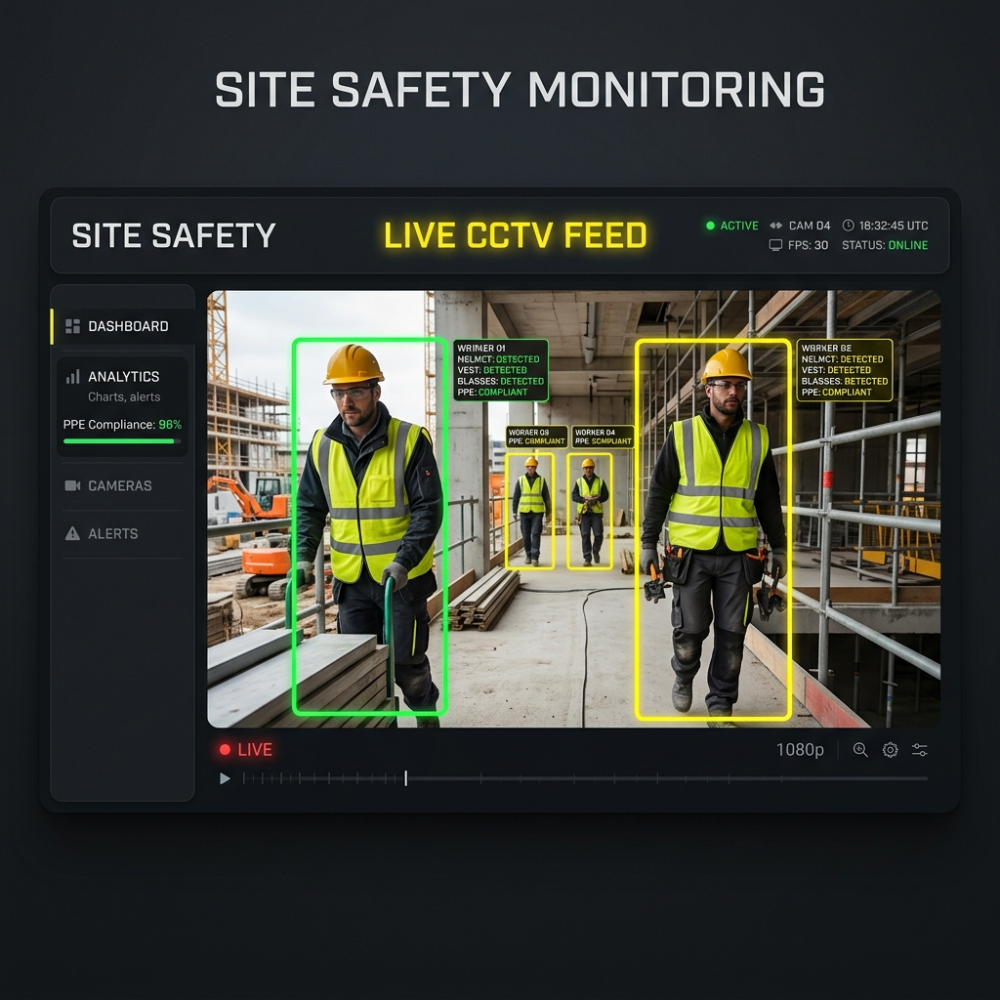
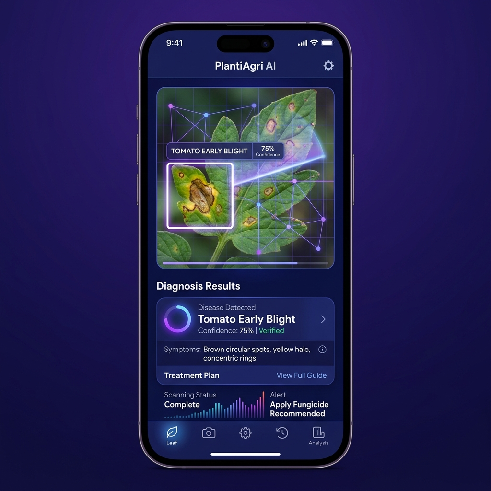
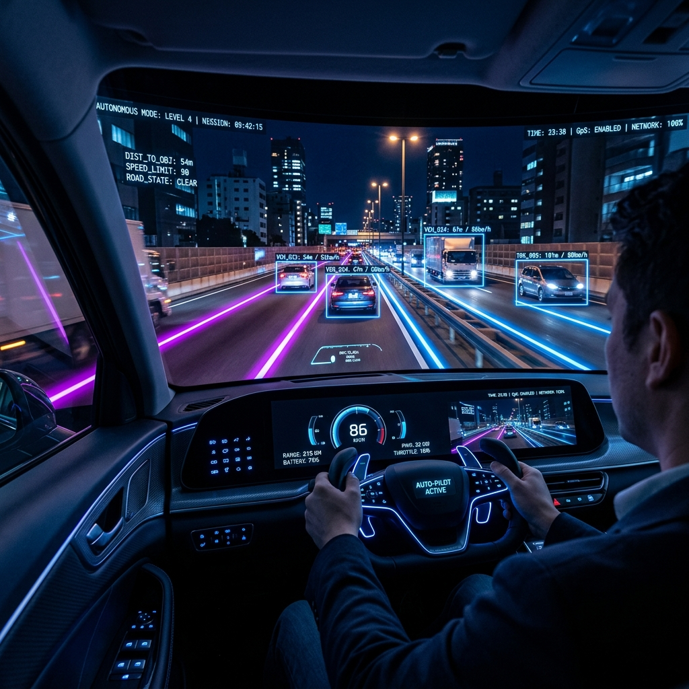
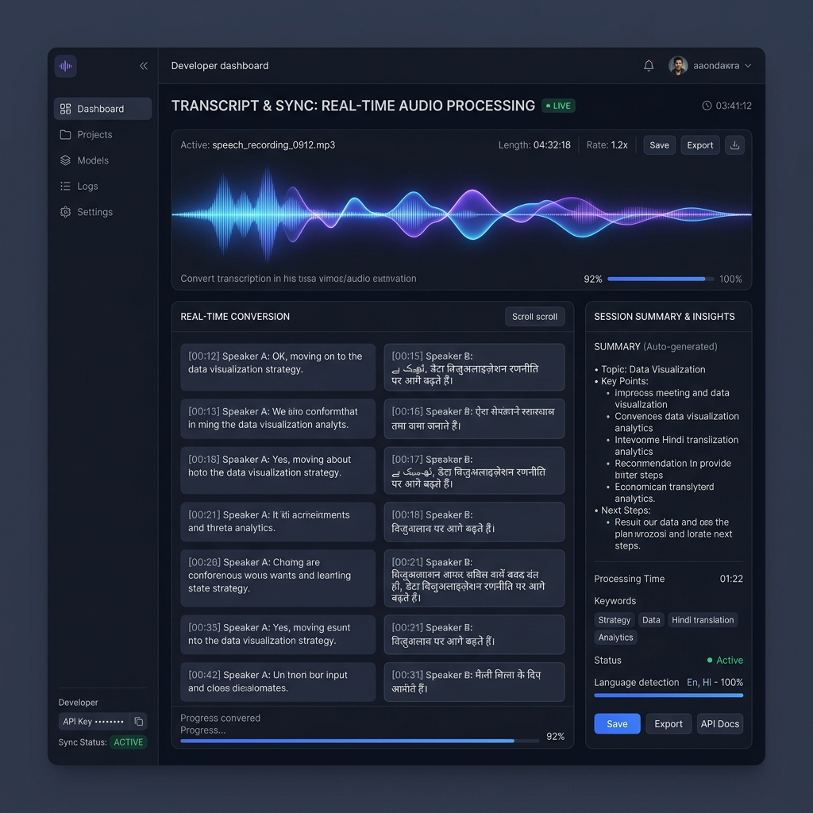

<!-- ══════════════════════════════════════════════════════════════ -->
<!--              VEERAVASANTHAN | AI ENGINEER PROFILE             -->
<!-- ══════════════════════════════════════════════════════════════ -->

<!-- Header Banner -->

<!-- Typing Subtitle -->

<!-- Profile Metrics & Contact Badges -->

  
  &nbsp;
  
  &nbsp;
  
  &nbsp;
  

---

### 🧬 About Me

<blockquote>
  
👋 <strong>Hello, I'm Veeravasanthan.</strong>

  
I am a B.Tech Artificial Intelligence & Data Science student passionate about building real-world AI, Deep Learning, and Computer Vision systems. With a strong foundation in software engineering and a published research paper, I bridge the gap between academic research and production-grade ML applications.

</blockquote>

- 🧠 **Focus Area** &nbsp;•&nbsp; Generative AI, Computer Vision, and Natural Language Processing.
- 🔬 **Research** &nbsp;•&nbsp; IEEE conference author exploring healthcare automation and IoT.
- ⚙️ **Core Goal** &nbsp;•&nbsp; Building efficient, scalable, and impactful AI models.

---

### ⚡ Tech Arsenal

<table width="100%">
  <tr>
    <td width="50%" valign="top">
      <strong>💻 Languages</strong> 
      
      
      
      
      
    </td>
    <td width="50%" valign="top">
      <strong>🧠 AI & Machine Learning</strong> 
      
      
      
      
      
    </td>
  </tr>
  <tr>
    <td width="50%" valign="top">
      <strong>📊 Data & Databases</strong> 
      
      
      
      
    </td>
    <td width="50%" valign="top">
      <strong>🛠️ Tools & MLOps</strong> 
      
      
      
      
      
    </td>
  </tr>
</table>

---

### 🚀 Featured AI Projects

<table width="100%">
  <tr>
    <td width="50%" valign="top">
      
        
      <h4>🛡️ Safeguard AI</h4>
      
<em>Real-time PPE Detection & Safety Monitoring</em>

      
Industrial safety monitoring system utilizing YOLOv8 and Gemini AI to detect Personal Protective Equipment with <strong>95% accuracy</strong> and trigger instant violation alerts.

      <code>Python</code> <code>YOLOv8</code> <code>OpenCV</code> <code>Gemini AI</code>
    </td>
    <td width="50%" valign="top">
      
        
      <h4>🌿 Agro Vision</h4>
      
<em>AI-Powered Plant Disease Classifier</em>

      
Deep learning classification model focused on analyzing crop health and diagnosing plant leaf diseases to provide actionable treatment suggestions.

      <code>Python</code> <code>TensorFlow</code> <code>Scikit-Learn</code> <code>Pandas</code>
    </td>
  </tr>
  <tr>
    <td width="50%" valign="top">
      
        
      <h4>🚗 Cognitive Drive</h4>
      
<em>Self-Driving Car Simulation</em>

      
End-to-end autonomous vehicle controller using the NVIDIA CNN architecture in a simulated environment for path tracking, lane detection, and steering.

      <code>TensorFlow</code> <code>OpenCV</code> <code>NVIDIA CNN</code>
    </td>
    <td width="50%" valign="top">
      
        
      <h4>📝 Meeting Minutes</h4>
      
<em>Multilingual NLP Meeting Summarizer</em>

      
High-accuracy speech-to-text and summarization pipeline powered by Whisper and Gemini AI supporting English, Tamil, Hindi, and Malayalam.

      <code>Python</code> <code>Whisper ASR</code> <code>Gemini AI</code> <code>NLP</code>
    </td>
  </tr>
</table>

---

### 📚 Research & Publications

<blockquote>
  <h4>📄 A Smart Pill Dispenser with Real-Time Alerts, Remote Access and Enhanced Safety</h4>
  
Presented and published in peer-reviewed IEEE international conferences:

  <ul>
    <li>🏛️ <strong>ICDCC 2024</strong> (International Conference on Data Communication)</li>
    <li>🏛️ <strong>ICCIRT 2024</strong> (International Conference on Innovative Research)</li>
  </ul>
  
<em>Keywords: Healthcare AI, Internet of Things (IoT), Embedded Systems</em>

</blockquote>

---

### 🏆 Achievements & Milestones

 

  
  &nbsp;&nbsp;
  
  &nbsp;&nbsp;
  
    
  
  &nbsp;&nbsp;
  

 

---

### 📊 GitHub Analytics

&nbsp;&nbsp;

---

#### 📬 Let's Connect

**[Email](mailto:veeravasanthan@example.com)** &nbsp;•&nbsp; **[LinkedIn](https://linkedin.com/in/veeravasanthan)** &nbsp;•&nbsp; **[GitHub](https://github.com/Veeravasanthan)**

*Designed for elegance & clarity. Open to AI/ML internships, research collaborations, and developer roles.*

